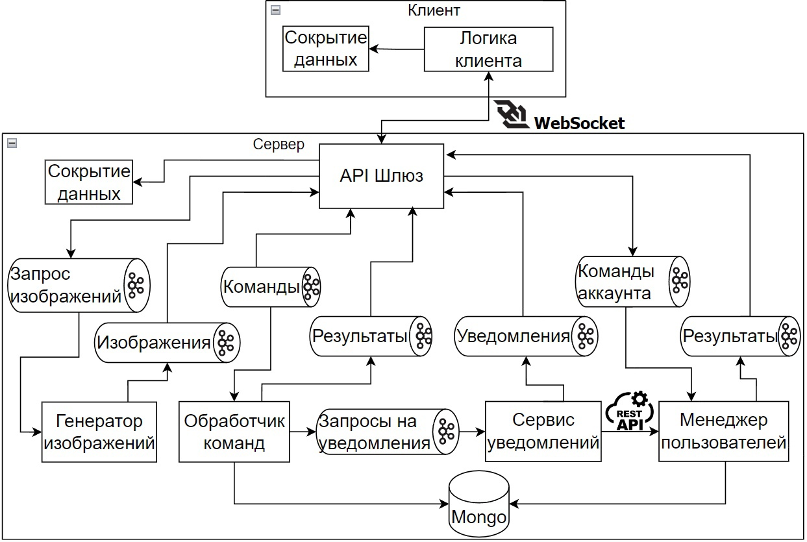
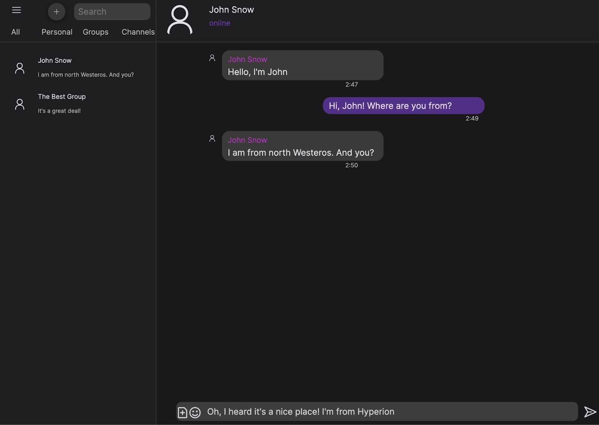
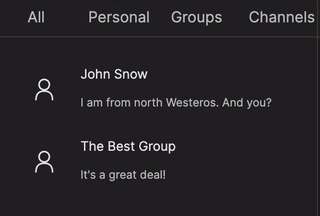
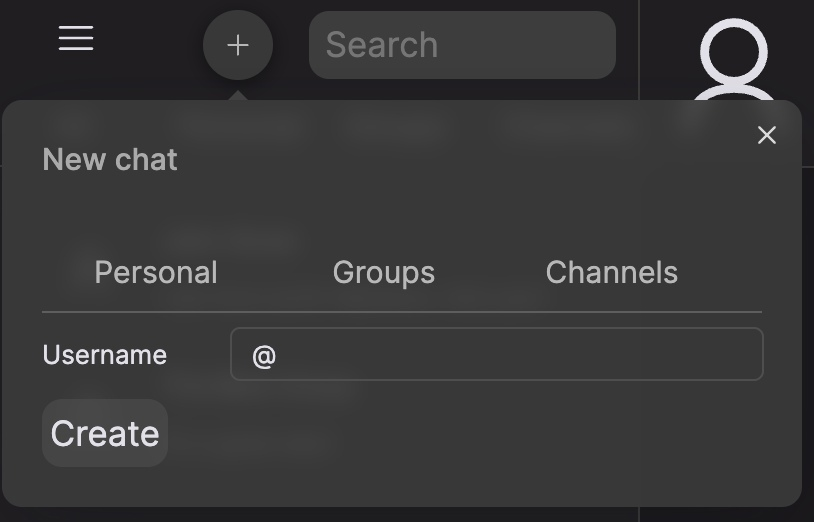
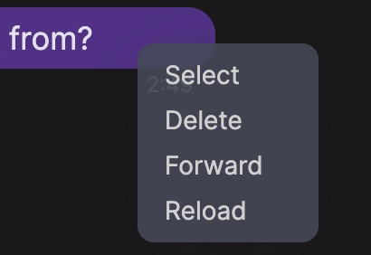

# Messenger
`Дипломный проект`

Автор: студент кафедры 806 МАИ Козлов Данила Олегович

Мессенджер в виде web-приложения. Разработан на основе микросервисной архитектуры.
Обмен сообщениями реализован на основе протокола с применением стеганографии.

## Архитектура

Приложение разработано на основе микросервисной архитектуры.

- Клиент и сервер взаимодействуют посредством веб-сокетов.
- Модули взаимодействуют между собой через топики Kafka, за исключением связи между сервисом уведомлений и менеджером пользователей.
- Обработчик команд и менеджер пользователей обращаются к БД под управлением MongoDB.

Модули:

- API Шлюз - входная точка, с которой начинается обработка всех запросов. Здесь же происходит выполнение алгоритма сокрытия данных.
- Обработчик команд - сервис, который слушает топик с командами, направленными на взаимодействие с сущностями чата, сообщения и настроек.
- Сервис уведомлений - как следует из названия, отвечает за формирование уведомлений пользователям онлайн.
- Генератор изображений - сервис, который отвечает за непрерывную генерацию изображений для нужд алгоритма стеганографии.
- Менеджер пользователей - сервис, который отвечает за аутентификацию пользователей и за отслеживание статуса онлайн.

## Интерфейс

### Главная страница

### Список чатов

### Создание чата

### Меню действий с сообщением

